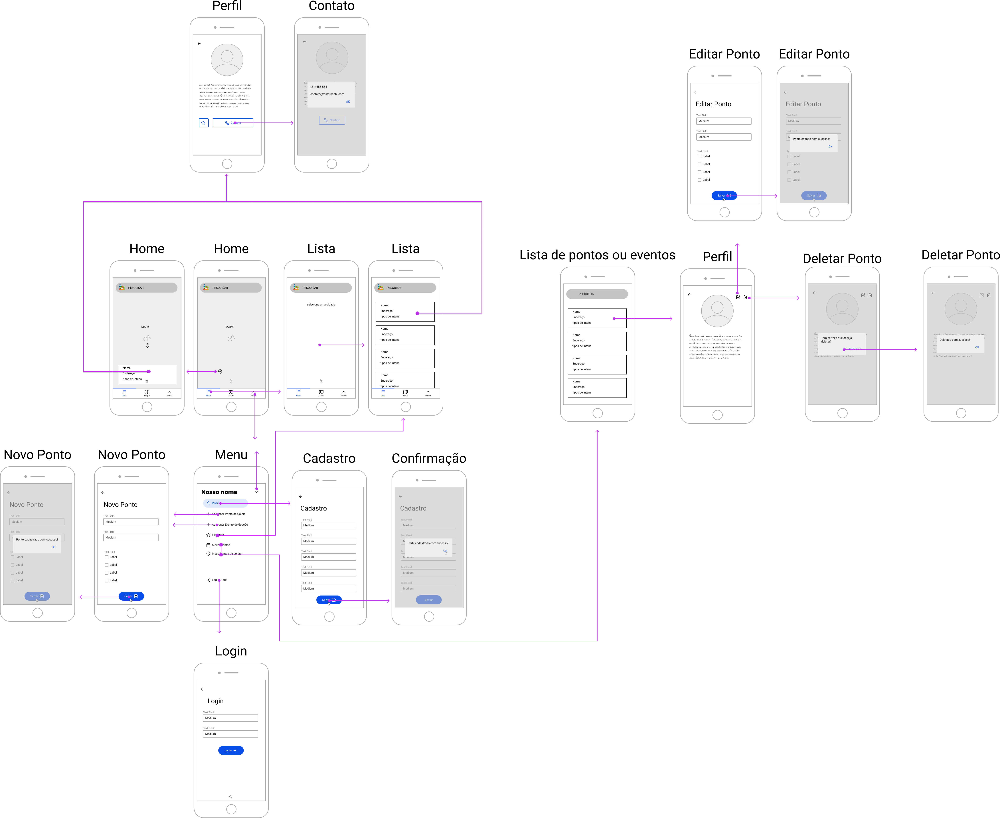
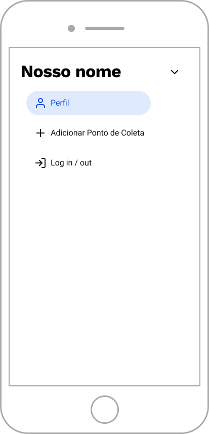

# Projeto de Interface

Pré-requisitos: <a href="2-Especificação do Projeto.md"> Documentação de Especificação</a>

A interface foi projetada utilizando o processo de design centrado no usuário e o conceito Mobile First a fim de oferecer a melhor experiência do usuário, usabilidade e acessibilidade.

## User Flow
  

  
O diagrama acima apresenta o fluxo de interação do usuário pelas telas da aplicação.

## Wireframes

Abaixo apresentamos o detalhamento e descrição dos wireframes mostrados no fluxo de usuário. O wireframe interativo pode ser encontrado abaixo: <iframe style="border: 1px solid rgba(0, 0, 0, 0.1);" width="800" height="450" src="https://www.figma.com/embed?embed_host=share&url=https%3A%2F%2Fwww.figma.com%2Fproto%2FAm9uOV7d5cALEt0lydM26W%2FOnde-Doar-team-library%3Fnode-id%3D362%253A7376%26scaling%3Dmin-zoom%26page-id%3D362%253A5861%26starting-point-node-id%3D362%253A7376" allowfullscreen></iframe>

### Componentes comuns a todas as telas

- Rodapé: onde estão dispostos os botões 'Lista' para listar pontos de coleta, 'Mapa' para visualizar
pontos de coleta no mapa e 'Menu' para acessar o menu da aplicação.    

 
 

 

### Tela - Home
Apresenta mapa com pontos de coleta próximos à localização do usuário.

Os componentes encontrados na tela são:
 - Mapa
 - Barra de pesquisa
 - Informações do ponto selecionado
 - Rodapé
   

 
 

 

### Tela - Listar Pontos ou Eventos de Coleta
Apresenta lista de pontos ou eventos de coleta de acordo com a seleção no mapa ou pesquisa realizada.

Os componentes encontrados na tela são:
 - Campo que permite que o usuário busque por um ponto de coleta
 - Lista que permite selecionar um dos pontos ou eventos próximos
  

 

 

### Tela - Visualizar Ponto ou Evento de Coleta
Apresenta informações do ponto ou evento de coleta selecionado

Os componentes encontrados na tela são:
 - Dados do ponto ou evento de coleta
 - Botões "Editar" e "Deletar"
  

 

 

### Tela - Editar Ponto de Coleta
Apresenta formulário para edição dos dados do ponto de coleta

Os componentes encontrados na tela são:
 - Formulário de edição
 - Botão "Salvar" que efetua a atualização dos dados do ponto de coleta na base de dados da aplicação e apresenta mensagem de sucesso
  

 
 

 

### Tela - Deletar Ponto de Coleta
Apresenta modal de confirmação de exclusão

Os componentes encontrados na tela são:
 - Modal de confirmação de exclusão
 - No modal, Botão "Ok" que efetua a exclusão dos dados do ponto de coleta na base de dados da aplicação e apresenta mensagem de sucesso e
 'Cancelar' que cancela a ação
  

 
 

 

### Tela - Cadastro Usuário
Apresenta o formulário de cadastro de usuário.

Os componentes encontrados na tela são:
 - Formulário de cadastro de usuário
 - Botão "Salvar" que efetua o cadastro do usuário na base de dados da aplicação, apresenta mensagem de sucesso e o direciona para a página Home

  

 
 

 

### Tela - Cadastro Ponto de Coleta
Apresenta o formulário de cadastro de ponto de coleta.

Os componentes encontrados na tela são:
 - Formulário de cadastro de ponto de coleta
 - Botão "Salvar" que efetua o cadastro do ponto de coleta na base de dados da aplicação e apresenta mensagem de sucesso

  

 
 

 

### Tela - Login
Apresenta o formulário para logar na aplicação

Os componentes encontrados na tela são:
 - Formulário de login
 - Botão "Login" que realiza a autenticação do usuário na base de dados da aplicação

  

 

 

O protótipo apresentado nesta seção foi criado e pode ser acessado pela [plataforma Figma.](https://www.figma.com/file/Am9uOV7d5cALEt0lydM26W/Onde-Doar-team-library?node-id=312%3A2) 
