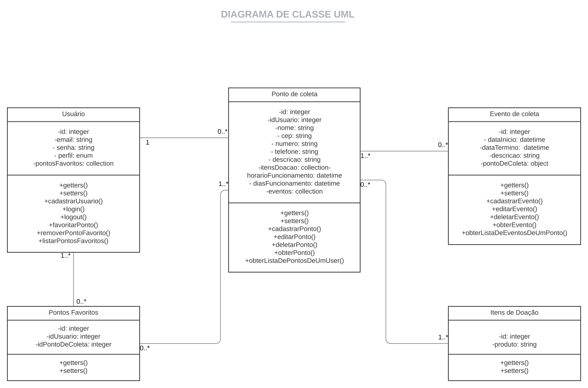
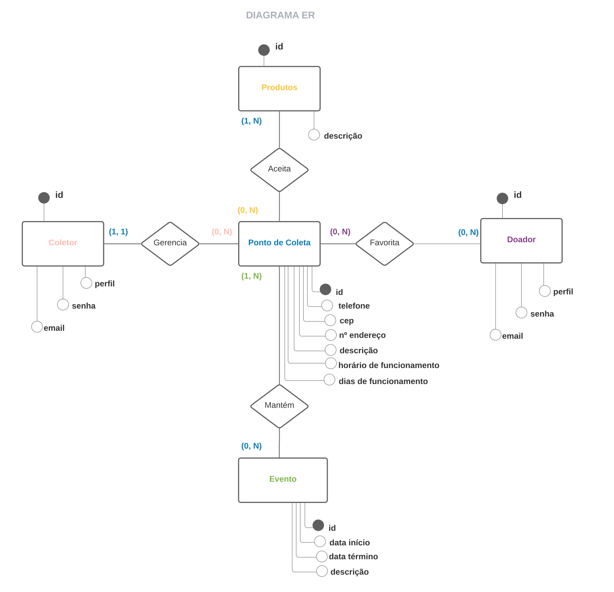
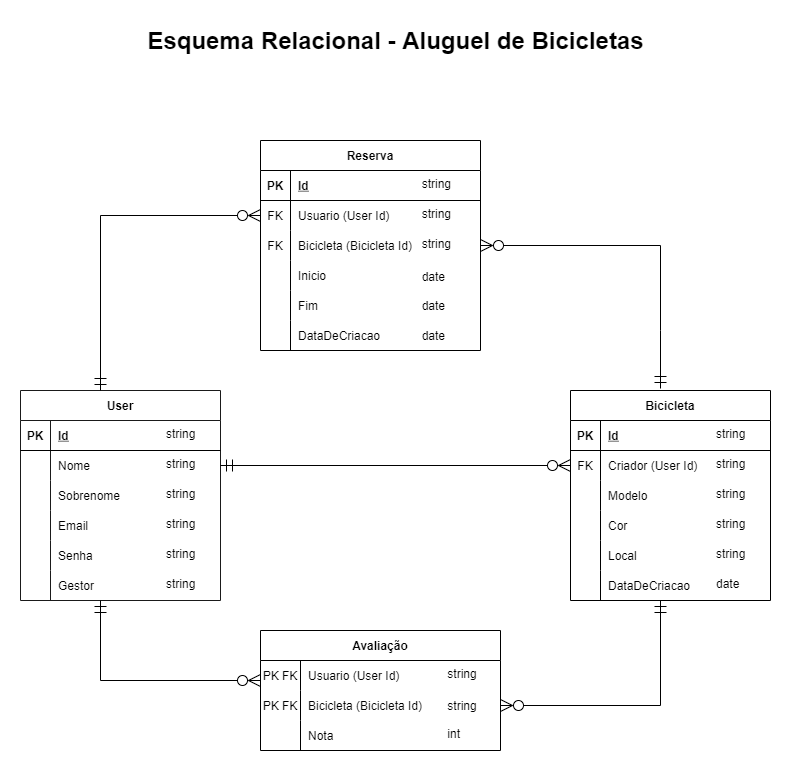

# Arquitetura da Solução

Pré-requisitos: <a href="3-Projeto de Interface.md"> Projeto de Interface</a>

Nesta seção apresentamos a definição da estrutura do software em termos dos componentes que fazem parte da solução e do ambiente de hospedagem da aplicação.

## Diagrama de Classes

Diagrama que ilustra as classes que compõem o sistema, bem como seus atributos, métodos e relações entre objetos.

    

## Modelo ER

Diagrama que descreve o conjunto de entidades do sistema, seus atributos e relacionamentos.

    

## Esquema Relacional

Esquema que representa o relacionamento entre as tabelas que armazenam os dados necessários ao sistema.

    

## Tecnologias Utilizadas

### Front-end

#### [Typescript](https://pt.wikipedia.org/wiki/TypeScript) 
TypeScript é uma linguagem de programação de código aberto desenvolvida pela Microsoft. É um superconjunto sintático estrito de JavaScript e adiciona tipagem estática opcional à linguagem.

#### [Styled Components](https://medium.com/nossa-coletividad/styled-components-padr%C3%B5es-em-produ%C3%A7%C3%A3o-4958e91d4d92)
Styled-components é uma biblioteca para React e React Native que permite que você use estilos ao nível de componente na sua aplicação. Eles são escritos em uma mistura de JavaScript com CSS.

#### [Eslint](https://oieduardorabelo.medium.com/evitando-erros-com-eslint-91b5a4bb9471)
ESLint é uma ferramenta de lint plugável para JavaScript e JSX.
Linting é o processo de aplicar regras a uma base de código e destacar padrões ou códigos problemáticos que não aderem a determinadas diretrizes de estilo.

O linting moderno de JavaScript também inclui a correção automática de problemas. E uma das ferramentas que permitem esse tipo de verificação é o ESLint, um projeto de código aberto em JavaScript que permite que os desenvolvedores descubram problemas com seu código sem a necessidade de executá-lo.

#### [Node.js](https://tecnoblog.net/410498/o-que-e-node-js-guia-para-iniciantes/)
Node.js é um ambiente de execução JavaScript que permite executar aplicações desenvolvidas com a linguagem de forma autônoma, sem depender de um navegador. Com ele, é possível criar praticamente qualquer tipo de aplicações web, desde servidores para sites estáticos e dinâmicos, até APIs e sistemas baseados em microserviços.

#### [React.js](https://pt-br.reactjs.org/tutorial/tutorial.html#what-is-react)
O React é uma biblioteca JavaScript declarativa, eficiente e flexível para criar interfaces com o usuário. Ele permite compor UIs complexas a partir de pequenos e isolados códigos chamados “componentes”.

#### [Jest](https://www.devmedia.com.br/teste-unitario-com-jest/41234)
Jest é um framework de teste unitário de código aberto em JavaScript criado pelo Facebook a partir do framework Jasmine. Jest é uma das ferramentas de teste unitário mais difundidas dentro da comunidade de JavaScript.

#### [Cypress](https://medium.com/@faelbercam/um-overview-sobre-cypress-io-framework-de-automa%C3%A7%C3%A3o-de-testes-end-to-end-dc438b9ee7a1)
O Cypress.io é um framework de testes automatizados end-to-end usando JavaScript! O Cypress também opera na camada de rede, lendo e alterando o tráfego da web em tempo real. Isso permite que o Cypress não apenas modifique tudo que entra e sai do navegador, mas também altere o código que pode interferir em sua capacidade de automatizar o navegador. 

O Cypress por fim, controla todo o processo de automação de cima para baixo, o que o coloca em uma posição única de poder entender tudo o que acontece dentro e fora do navegador. Isso significa que ele é capaz de fornecer resultados mais consistentes do que qualquer outra ferramenta de testes.

#### [Vscode](https://pt.wikipedia.org/wiki/Visual_Studio_Code)
O Visual Studio Code é um editor de código-fonte desenvolvido pela Microsoft para Windows, Linux e macOS. Ele inclui suporte para depuração, controle de versionamento Git incorporado, realce de sintaxe, complementação inteligente de código, snippets e refatoração de código. Ele é customizável, permitindo que os usuários possam mudar o tema do editor, teclas de atalho e preferências. Ele é um software livre e de código aberto, apesar do download oficial estar sob uma licença proprietária.

### Back-end

#### [C#](https://pt.wikipedia.org/wiki/C_Sharp)
C# é uma linguagem de programação, multiparadigma, de tipagem forte, desenvolvida pela Microsoft como parte da plataforma .NET. A sua sintaxe orientada a objetos foi baseada no C++ mas inclui muitas influências de outras linguagens de programação, como Object Pascal e, principalmente, Java. O código fonte é compilado para Common Intermediate Language (CIL) que é interpretado pela máquina virtual Common Language Runtime (CLR). C# é uma das linguagens projetadas para funcionar na Common Language Infrastructure da plataforma .NET Framework.

#### [SonarLint](https://www.sonarlint.org/visualstudio/)
O SonarLint é uma ferramenta de lint plugável a algumas IDE's como Eclipse, IntelliJ, VSCode entre outros. A ferramenta lint vai verificar o código do seu projeto e procurar pequenos erros no código durante o desenvolvimento.

#### [xUnit.net](https://blog.cedrotech.com/xunit-net-um-produto-testado-e-certamente-de-melhor-qualidade)
xUnit é uma ferramenta gratuita e de código aberto construída para o .NET Framework.

Serve para auxiliar na construção e execução de testes unitários, ou melhor, trechos de códigos construídos para testar partes específicas de determinado sistema. Geralmente executados em partes separadas da aplicação e organizados de maneiras variadas de acordo com o tipo de linguagem de programação ou o tipo de software.

#### [Entity Framework](https://docs.microsoft.com/pt-br/ef/)
O Entity Framework Core é um mapeador moderno de banco de dados de objeto para .NET. Ele dá suporte a consultas LINQ, controle de alterações, atualizações e migrações de esquema. O EF Core funciona com muitos bancos de dados, incluindo o Banco de Dados SQL (local e do Azure), o SQLite, o MySQL, o PostgreSQL e o Azure Cosmos DB.

#### [ASP.NET Core Identity](https://docs.microsoft.com/pt-br/aspnet/core/security/authentication/identity?view=aspnetcore-5.0&tabs=visual-studio)
É uma API que dá suporte à funcionalidade de logon da interface do usuário.
Gerencia usuários, senhas, dados de perfil, funções, declarações, tokens, confirmação por email e muito mais.

#### [Swagger](https://swagger.io/)
Trata-se de uma aplicação open source que auxilia desenvolvedores nos processos de definir, criar, documentar e consumir APIs REST.

### Banco de dados

#### [PostgreSQL](https://www.postgresql.org/)
PostgreSQL é um sistema gerenciador de banco de dados objeto relacional, desenvolvido como projeto de código aberto.

### Hospedagem

A equipe optou pela plataforma Heroku como ambiente de hospedagem da aplicação. 
<i>Como o Heroku não suporta .NET Core nativamente, o deploy será feito atráves da conteinerização da aplicação com [Docker](https://www.docker.com/).</i>

