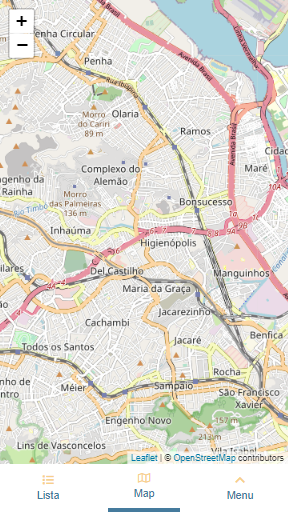
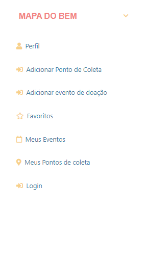
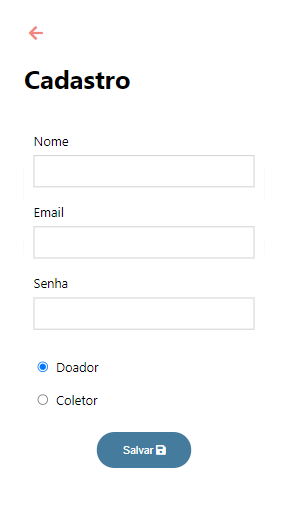
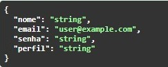
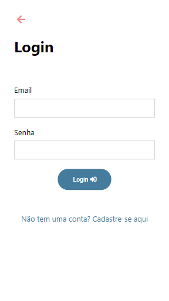
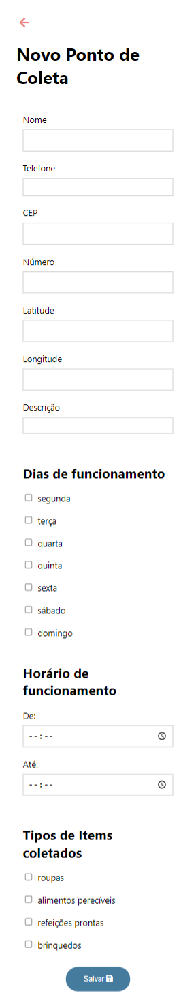
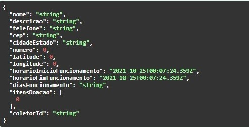

# Programação de Funcionalidades

Pré-requisitos: <a href="2-Especificação do Projeto.md"> Especificação do Projeto</a>, <a href="3-Projeto de Interface.md"> Projeto de Interface</a>, <a href="4-Metodologia.md"> Metodologia</a>, <a href="3-Projeto de Interface.md"> Projeto de Interface</a>, <a href="5-Arquitetura da Solução.md"> Arquitetura da Solução</a>

Nesta seção apresentamos as telas desenvolvidas para cada uma das funcionalidades do sistema.

OBS: Como o site ainda não está hospedado é necessario subir o back e depois o front. Para subir o back é necessário ter o sql server rodando. No visual studio rode Update-Database dentro do console do Nuget. Depois é só usar o botão de run do próprio visual studio. Depois, para subir o front, acesse pelo terminal o diretório 'code/ts', rode o comando "yarn" e, depois que tudo for instalado, rode "yarn start" para subir o localhost.

Caso esteja usando um mac, será necessário subir o sql server no docker com uma PORTA, USUARIO e SENHA e alterar a "ConnectionStrings" no arquivo "appsettings.json" para 

    "MapaDoBem": "Server=localhost,PORTA;Database=mapa-do-bem-db;Trusted_Connection=false;User Id=USUARIO; Password=SENHA;"

## Home - Mapa

A página apresenta um mapa com pontos de coleta próximos à localização do usuário.

 

### Requisitos Atendidos
- RF-009

### Instrução de Acesso
1. Abra um navegador de Internet e informe a seguinte URL: http://localhost:3000

  

## Cadastro de Usuário

A página Cadastro do sistema apresenta um formulário de cadastro para criação de perfil do usuário, sendo os tipos de perfis: 
Coletor ou Doador.

### Requisitos Atendidos
- RF001 e RF002

### Estrutura de Dados

 

### Instrução de Acesso
1. No rodapé clique na opção menu
2. No menu, escolha a opção Login e em seguida acesse o formulário de cadastro através do link "Não tem uma conta? Cadastre-se aqui"

  

## Login 

A página Login apresenta um formulário com dois campos: email e senha, que permite que o usuário inicie uma sessão no sistema.  
 

### Requisitos Atendidos
- RF003

### Instrução de Acesso
1. No rodapé clique na opção menu
2. No menu escolha a opção Login

  

## Cadastro de Ponto de Coleta

A página Cadastro de Ponto de Coleta apresenta um formulário de cadastro para criação de um ponto de coleta. 
O formulário possui integração com a API [ViaCEP]("https://viacep.com.br/").

 

### Requisitos Atendidos
- RF010

### Estrutura de Dados

 

### Instrução de Acesso
1. Acesse o menu no rodapé 
2. Realize o login clicando na opção Login
3. Acesse a página de Cadastro de Ponto de Coeta pela opção "Adicionar Ponto de Coleta"

  
